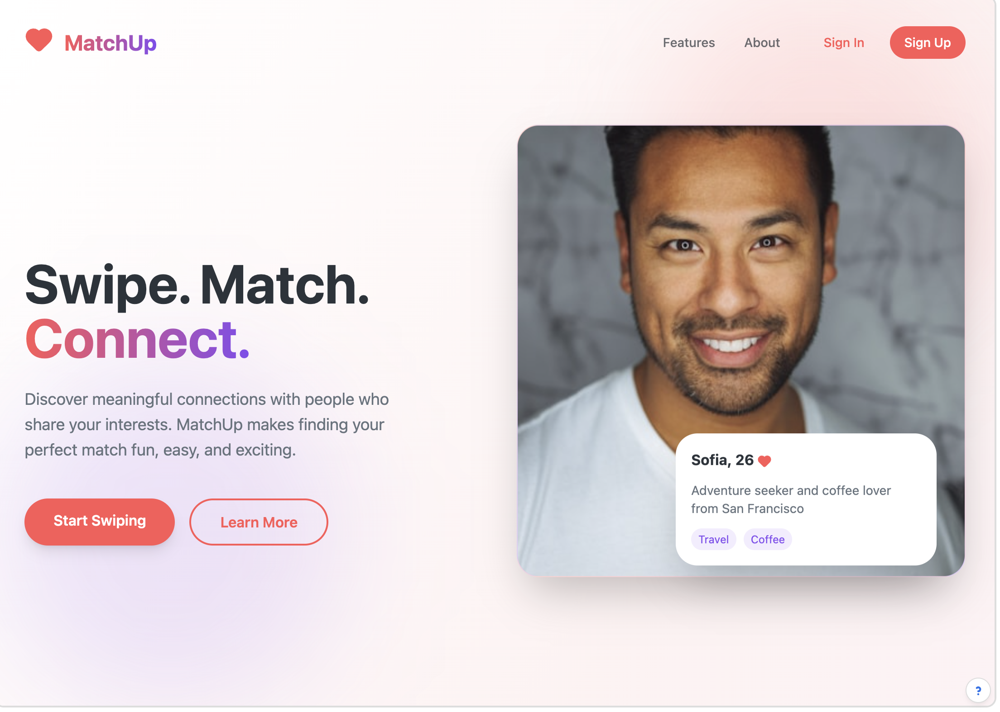
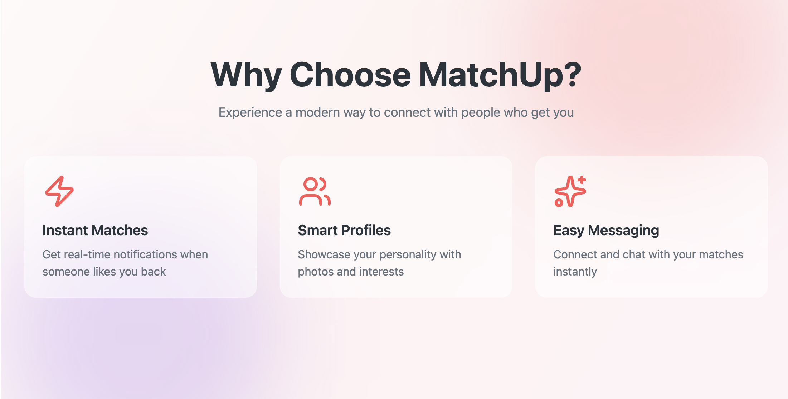
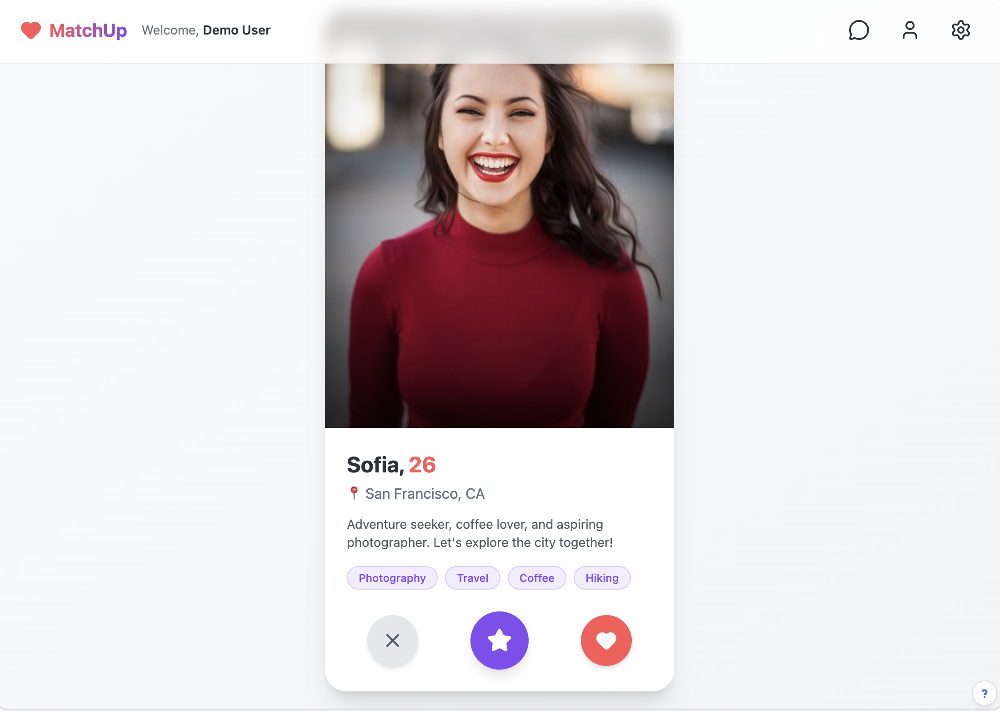
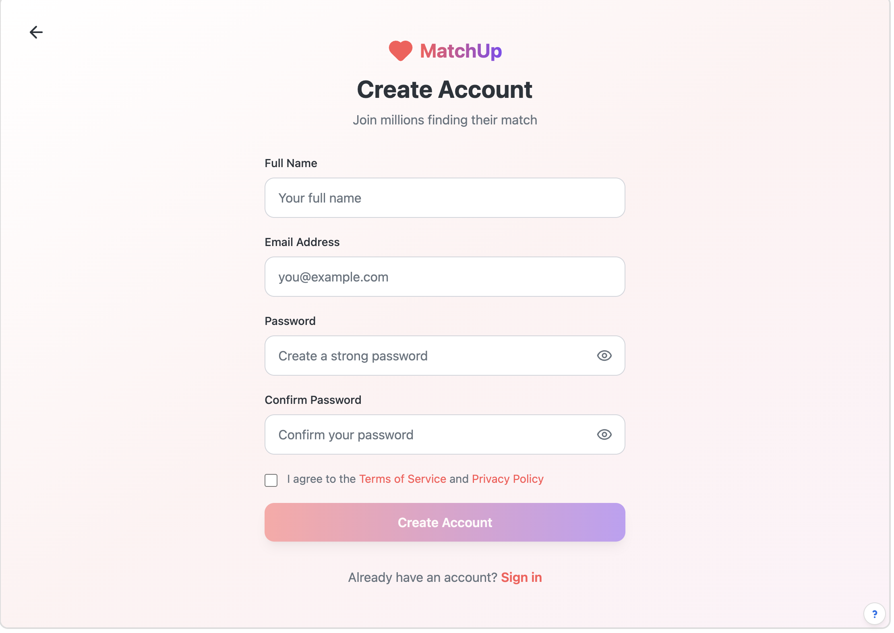
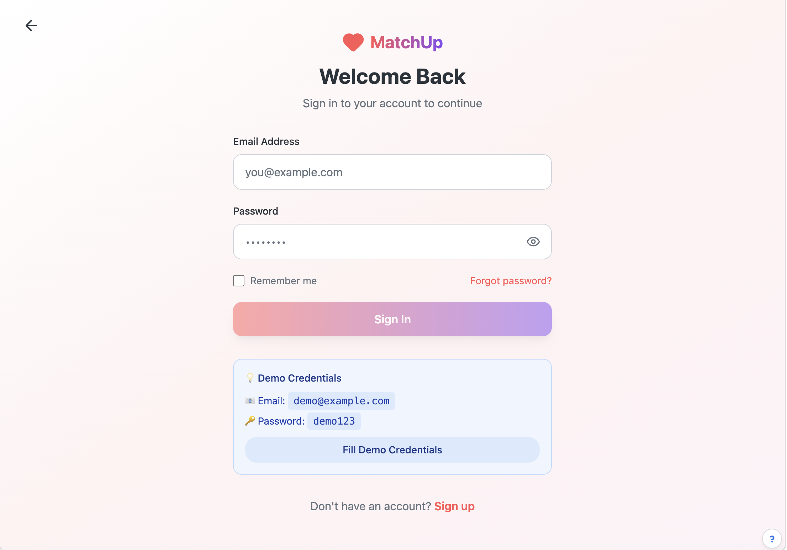
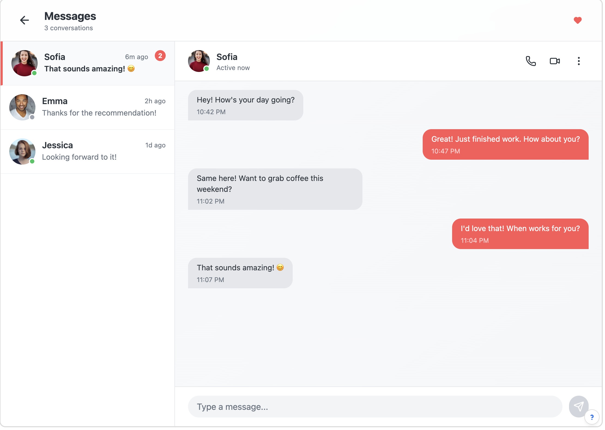

# ❤️ MatchUp – Modern Dating Web App (Frontend)

MatchUp is a modern, swipe-based **frontend-only dating web application** inspired by platforms like Tinder and Bumble.  
It focuses on UI/UX, smooth interactions, and clean component architecture **without any backend integration**.

Built with **React**, **TypeScript**, and **Tailwind CSS**, this project showcases a production-quality dating app interface with authentication flows, swipe cards, chat UI, and profile management using mock data.  

---

## 🖼 App Screenshots

  
  

  
  

  
  

  

---

## ✨ Features

### 🔐 Authentication (UI Only)
- Signup & Login screens
- Client-side state handling
- Demo user flow (no real authentication)
- Route protection using mock state

### 🧑‍🤝‍🧑 Discover & Match
- Swipe-style profile cards
- Like, Super-Like, and Skip UI actions
- Interest tags & profile details
- Age & location display (mock data)

### 💬 Chat Interface (UI Only)
- Conversation list layout
- Message bubbles with timestamps
- Active status indicators
- Static / mock chat data

### 👤 Profile Management
- Profile view & edit UI
- Upload and preview multiple photos
- Set main profile image
- Bio & interests section

### 🎨 Modern UI/UX
- Fully responsive (mobile-first)
- Smooth transitions & hover effects
- Card-based layout
- Soft gradients & rounded components

---

## 🛠 Tech Stack

**Frontend**
- React
- TypeScript
- Vite
- Tailwind CSS
- Context API

**Tooling**
- pnpm
- Prettier
- PostCSS
- Builder.io (UI Prototyping)
---

